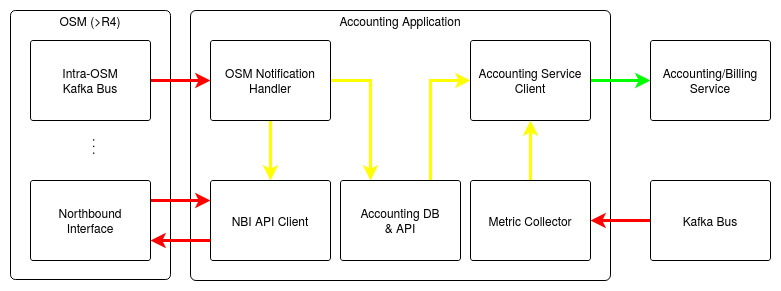
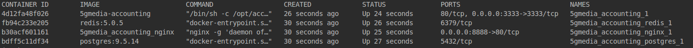

# 5G-MEDIA Accounting Agent

The purpose of Accounting agent is to find and keep track of the 
associations between Tenants, Network Services (NS), Virtualized Network Functions (VNFs) and (Virtual Deployment Units) 
VDUs, receive metrics regarding VDUs for billing purposes of a catalogue tenant and push them to a service through an 
available API. Accounting agent is basically composed by six components:

  * __OSM Notification Handler__: Connects to OSM's intra-Kafka broker and receives notifications about NSs 
  * __Accounting Client__: A client for the API offered by the billing-accounting service
  * __Metric Collector__: Connects to the Kafka Bus and receives desirable metrics for active VDUs
  * __API__: An API for an overview of the relations between ns, vnfs, vdus etc.
  * __Open MANO API__: A client for the API offered by the Open Source MANO (OSM)
  * __NBI API__: A client for the Northbound Interface (NBI) API offered by OSM



The interactions between the Accounting services and the outside world appear on the above schematic. The flow of execution
is as follows:

  * A Network service is created through OSM, and the OSM notification handler components receives a relevant notification;
  * Essential information about the newly created NS, such as VNF or VDU details are requested from OSM's Northbound Interface utilizing the NBI API client;
  * When the information are retrieved, the details of the newly created NS are saved;
  * The aforementioned details are used in order to initialize NS, VNF & VDU sessions at the Billing services;
  * A metric collector filters incoming metrics from the Kafka Bus and keeps resource-related metrics for the VDUs of active NS;
  * Periodically, the metric collector aggregates the collected data and reports the resource consumptions to the Billing Services.
 
These information pretty much give an overview of the accounting services' flow. Of course, in case of an NS' deletion,
a relevant procedure is followed, including the closing of the relevant sessions at the Billing services.


## Installation Guide

### Prerequisites

For the deployment of the Accounting services the Docker engine as well as docker-compose should be installed.
These actions can be performed following the instructions provided below. Firstly, an update should be performed
and essential packages should be installed:

```bash
sudo apt-get update
sudo apt-get install -y \
     apt-transport-https \
     ca-certificates \
     curl \
     software-properties-common
```

Secondly the key and Docker repository should be added:

```bash
curl -fsSL https://download.docker.com/linux/ubuntu/gpg | sudo apt-key add -
sudo add-apt-repository \
     "deb [arch=amd64] https://download.docker.com/linux/ubuntu \
     $(lsb_release -cs) \
     stable"
```

Then another update is performed, Docker is installed and the user is added to docker group.

```bash
sudo apt-get update
sudo apt-get install -y docker-ce
sudo groupadd docker
sudo usermod -aG docker $USER

```

Finally, docker-compose should be installed:

```bash
sudo curl -L "https://github.com/docker/compose/releases/download/1.24.0/docker-compose-$(uname -s)-$(uname -m)" -o /usr/local/bin/docker-compose
sudo chmod +x /usr/local/bin/docker-compose
```

### Environmental Parameters

The services that are executed as containers, thus forming the Accounting services receive their configurations
from a .env file located in the root of the repository. In the following tables, the environmental parameters
that are necessary for the configuration and deployment of Accounting are recorded and described.

__Docker-related Parameters__

| Parameter | Description |
| --------- | ----------- |
| COMPOSE_PROJECT_NAME | The project name |
| PG_IMAGE_TAG | Postgres Docker image tag |
| PG_PORT | Postgres Port |
| PG_USER | Postgres Username |
| PG_PASSWORD | Postgres Password |
| PG_DB | Postgres DB Name |
| REDIS_IMAGE_TAG | Redis Docker image tag |
| REDIS_PORT | Redis Port |

__Internal Services__

| Parameter | Description |
| --------- | ----------- |
| ACC_ENV | Environment |
| ACC_DEBUG | Enable / Disable Debugging |
| ACC_API_PORT | API Port |
| ACC_SUPERVISOR_PORT | Supervisor Port |
| ACC_DB_HOST | DB Host |
| ACC_DB_PORT | DB Port |
| ACC_DB_USER | DB User |
| ACC_DB_PASSWORD | DB Password |
| ACC_DB_NAME | DB Name |
| ACC_REDIS_HOST | Redis Host |
| ACC_REDIS_PORT | Redis Port |
| ACC_HOST_IP | Accounting Host IP |
| ACC_HOST_PORT | Accounting Host Port |
| ACC_HOST_PROTOCOL | Accounting Host Protocol |

__External Services__

| Parameter | Description |
| --------- | ----------- |
| ACC_KAFKA_SERVER | Kafka Host URL |
| ACC_OSM_HOST_IP | OSM Host IP |
| ACC_MANO_ID | MANO ID (e.g. `mano.osm5.eng.1`) |
| ACC_NFVIPOP_ID | NFVIPOP ID (e.g. `openstack.ocata.eng`) |
| ACC_BILLING_IP | Billing Host IP |
| ACC_BILLING_PORT | Billing Host Port |
| ACC_BILLING_PROTOCOL | Billing Host Protocol |
| ACC_BILLING_USERNAME | Billing Username |
| ACC_BILLING_PASSWORD | Billing Password |

### Deployment

Having cloned the repository and having created a .env in its root, the following command should be executed to bring up
the accounting services:

```bash
docker-compose up -d --build
```
When the images are built you will be able to see the following running containers:



You may access the Supervisor web UI to monitor the running applications through your selected port. The Accounting API
docs will be served at http://<ACC_HOST_IP>:<ACC_HOST_PORT>/api/v1/docs.

## Authors
- Singular Logic

## Acknowledgements
This project has received funding from the European Union’s Horizon 2020 research and innovation programme under grant agreement *No 761699*. The dissemination of results herein reflects only the author’s view and the European Commission is not responsible for any use that may be made 
of the information it contains.

## License
[Apache 2.0](LICENSE.md)